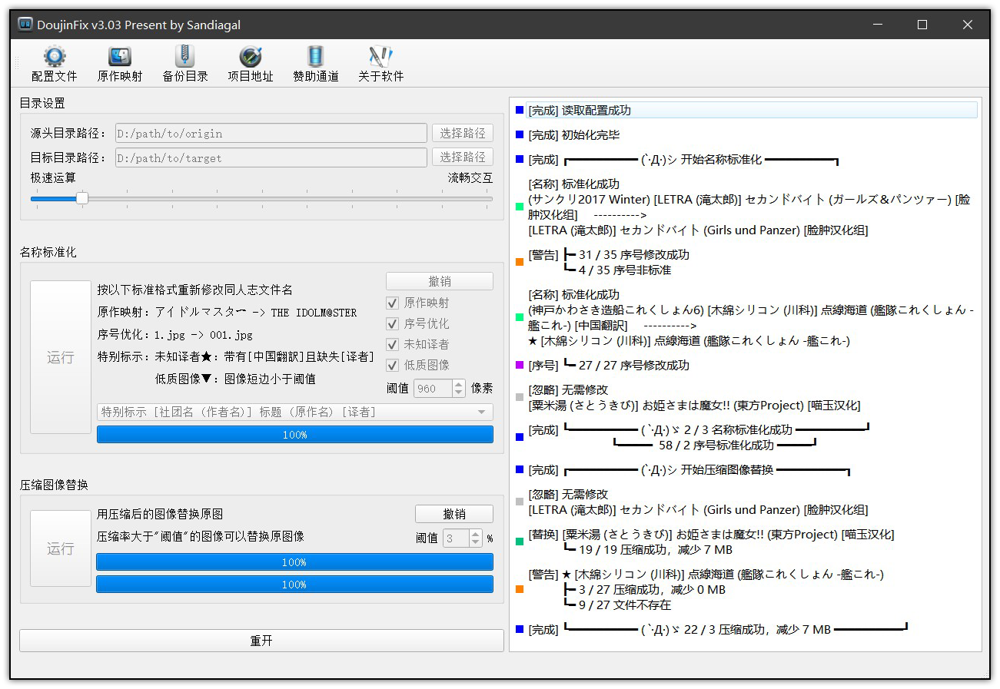
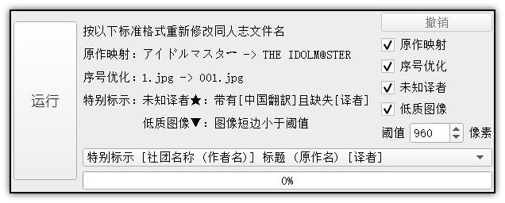
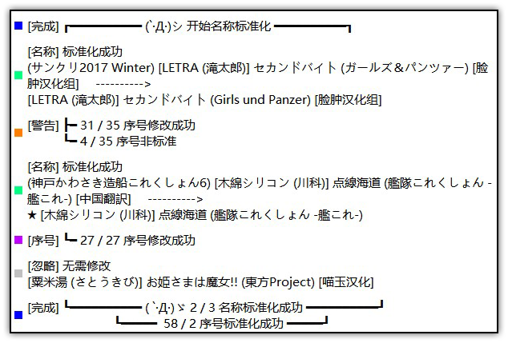

# DoujinFix 

[download-badge]: https://img.shields.io/github/downloads/Sandiagal/DoujinFix/total.svg?style=flat-square "Download status"

## 你发现了什么

DoujinFix 是一款基于 Qt 的批量整理同人志的软件，包括同人志文件名标准化和压缩图像替换功能。软件提供了完善丰富的交互功能，可以满足不同用户的整理需求。便捷高效实用是 DoujinFix 的制作目标。

详细使用说明请阅读 [DoujinFix Wiki](https://github.com/Sandiagal/DoujinFix/wiki)。

## 专为同人志而生

同人志为同人文化的产物，是指一群同好走在一起，所共同创作出版的书籍、刊物。在互联网模因的推动下，同人志呈现出百花齐放的态势，形成了现代不可忽略的文化因子之一。然而作为非官方非商业的产物，同人志的创作与流通没有统一标准。甚至各家都有一套自己的规定，导致人工的统一收集和储存都存在费时费力的困难。好在同人志的整体发展是趋于规范的，并且不同地方标准之间可以互相转换，所以我们开发了 DoujinFix 来自动地批量整理同人志。

## 开始旅程：30s使用说明

1. 指定“源头目录路径”

     
    
    待处理的多个同人志的文件夹。该文件夹应当形如如下结构：

        D:/path/to/origin
        ├── (例大祭2) [アンニュイ赤蛸 (たこ)] 二色蝶 (東方Project)
        |   ├── 001.jpg
        |   └── 002.png
        └── [楓牙] せつない想い
            ├── 001.jpg
            └── 002.png

2. 执行算法

    

    点击“运行”按钮即可。
    
    除非您明确自己的命名需求，否则请保持默认设置。

3. 欣赏结果

    
    
    所有文件夹的信息将显示在界面右侧。每条处理结果将包含：处理标示、原始名称、标准名称等信息。最后将进行结果总结，显示处理总数。

    用户请关注段首的处理标示，然后进行后续工作。
    - 灰色：名称已经标准。
    - 绿色：名称标准化处理正常。
    - 紫色：序号优化正常。
    - 橙色：处理异常。在名称修改中，原因可能为包含非法字符、非常见命名格式、文件中途变动等，请手动修改文件名称。在序号修改中，代表无法优化，请手动检查序号是否需要修改。
    - 蓝色：结果总结。

    如果对结果不满意，可以点击第2步中的“撤销”按钮进行撤销。

## 制作和感谢

DoujinFix 基于跨平台的 C++ 应用程式框架 [Qt](https://www.qt.io/) 开发，并修改了以下优秀的代码模块用以定制：

  - 配置管理，日志管理：原作者拉斐尔之翼；
  - 在线更新：原作者 alex-spataru。

感谢 Github 里的好友对 DoujinFix 的编写提供众多支持，拉斐尔之翼，alex-spataru，魂跃，Argh等。

感谢所有使用和支持 DoujinFix 的网友。

## 声明和协议

版权所有 (C) 2019 Sandiagal

本程序是自由软件，您可以遵照自由软件基金会 ( Free Software Foundation ) 出版的 GNU 通用公共许可证条款 ( GNU General Public License ) 第3版或者任一更新版本的前提下修改和重新发布这一程序。

发布这一程序的目的是希望它有用，但没有任何担保。甚至没有适合特定目的而隐含的担保。更详细的情况请参阅 GNU 通用公共许可证。

你理当已收到一份GNU通用公共许可协议的副本，如果没有，请查阅<http://www.gnu.org/licenses/>。

你可以通过 sandiagal2525@gmail.com 联系我们。
