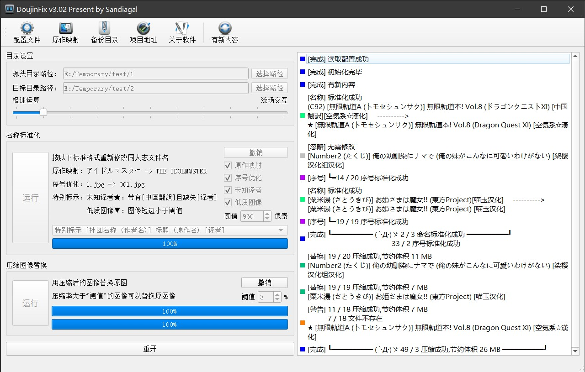

# FileManagement 

[download-badge]: https://img.shields.io/github/downloads/Sandiagal/DoujinFix/total.svg?style=flat-square "Download status"

一款集合了同人志文件名标准化和文件替换功能的便于批量整理同人志的软件。

## 简介

该软件是一款集合了同人志文件名标准化、图像压制和文件替换功能的便于批量整理同人志的软件。

由于国内的二次创作领域存在诸多“吃力不讨好”的现象，同人志在分享时存在名称中乱加标签的问题，加之专用名词的不统一，不规范的问题，给同人志的整理和收藏带来了不小的困难。此外，部分同人志的图像质量过好体积巨大，不利于整理，故经常需要进行压制。但图像的分享存在编码和质量不统一的问题，在压制后需要对体积压缩结果进行对比，费时费力。对此，为了能更方便的整理同人志，需要一款软件来解决上述问题。

## 名称标准化

### 内容介绍

要解释什么是名称标准化，就要先解释什么是“标准”。按照所见即所得的思路，目前最规范而全面的标准应该来自于 [E-Hentai Galleries](https://ehwiki.org/wiki/Renaming)。其格式可以概括为：

>   (即卖会名) \[社团名 (作者名)] 标题 (原作名) \[语言] \[译者]\[特殊标示]
>
>   (例大祭7) \[武蔵堂 (ムサシノセカイ)] マッシュルーム・サンバ (東方Project) \[英訳] \[DL版]

前面几项可以顾名思义，有则标注，无则缺省。而末尾的几项则需要一定经验性的解释。“\[语言]”只有在不使用同人志常用语言（日语、英语和汉语）时才会标注。“\[译者]”在主标题中一般只标注使用语言，例如“英訳”和“中国翻訳”；而在副标题才中会注明组织，例如“XX个人汉化”。“\[特殊标示]”则包括"ページ欠落"和"DL版"等非固定标示。

但是对于不同的发布渠道和收藏来说，其实用不到这么全面的格式。比如只针对特定语言的渠道，就不需要专门标注“\[语言]”；追求完整系列的人，也不会收集"ページ欠落"的作品。此外，部分发布渠道还会将“\[译者]”提到最前，以示对其工作的尊敬。而对个人而言，“(即卖会名)”的标签有些赘余。原本它可以便于搜索和记录作者的制作时间。但在实际中却存在多种体系，比如“Comiket”和“例大祭”等。全部使用一套体系还好，但混合使用则达不到按照时间排列的效果。

以上命名标准本身并无问题，但一旦混合出现，就难免造成麻烦。要收集大量同人志不可能只关注一个渠道，而不同渠道发布的同人志显然都有各自的标准。而且还有部分渠道的标准过于独特，自立门户。所以将这些同人志放在一个文件夹里，未免有些过于难堪。所以我们需要一款能够将不同同人志的名称修改到统一标准的软件。

### 功能说明

- 命名格式

  - 目前提供以下3种标准
  - 特别标示 \[社团名 (作者名)] 标题 (原作名) \[译者]
  - 特别标示 (即卖会名) \[社团名 (作者名)] 标题 (原作名) \[语言] \[译者]
  - 特别标示 (即卖会名) \[译者] \[社团名 (作者名)] 标题 (原作名) \[语言]

- 基本调整

  - 邻接连续空格只保留一个。
  - 每一项内容之间严格保持一个半角空格的间隔。
  - 所有类型的括号统一为半角形式。
  - 去掉“DL版”、“無修正”、“中国語”、“中国翻訳”、“オリジナル”等标识。
  - 将“～”和“(Various)”分别调整为“~”和“(よろず)”。

  - 无毒、CE和空気系等译者的各种署名分别统一为“无毒汉化组”、“CE家族社”和“空気系☆漢化”。

- 原作映射

  - “(原作名)”全部映射到原作发布时的官方名称。比如“東方”映射为“東方Project”、“KanColle”映射为“艦隊これくしょん -艦これ-”。
  - 若官方名称完全由片假名构成，则映射为对应的英文，比如“ラブライブ”映射为“Love Live!”、“アイドルマスター”映射为“THE IDOLM@STER”。
  - 具体映射关系可以自定义，关系表位于软件根目录下的“parodyMap.txt”中。每两行每一组，从第一行映射到第二行。若存在多组映射关系，则选取匹配度最大的一组，比如“オンライン”更匹配“ラグナロクオンライン”，而不是“ソードアート・オンライン”。

- 序号优化

  - 每一张图像的名称都_尽量_修改为三位数字，比如“00019_18”修改为“019”、“IMG_9”修改为“009”。
  - 保留无毒、CE等译者的特定格式，但去掉重复数字，比如“05_MJK_12_T345_005”修改为“MJK_12_T345_005”。

- 特别标示

  - 在名称上添加特殊标示，以便提示_手动_处理有以下该软件无法解决的问题。
  - 未知译者★：存在“中国翻訳”而缺失“\[译者]”时，用户需要自行查阅相关资料来添加“\[译者]”。
  - 低质图像▼：大部分图像的分辨率过低时，提醒用户可能下载了压缩档，需要更新图源。
 
  特别说明以上功能专门为“同人志”设计，请勿用在“同人声音”、“同人游戏”等文件。如果处理对象为“漫画”，则会将“\[杂志名]”按照“即卖会名”处理。

### 使用方法

- 1、指定“源头目录路径”

   
  
  待处理的多个同人志的文件夹。该文件夹应当形如如下结构：

      E:/Temporary/test/1
      ├── (例大祭7) [武蔵堂 (ムサシノセカイ)] マッシュルーム・サンバ (東方Project)
      |   ├── 001.jpg
      |   ├── 002.jpg
      |   └── ...
      ├── [楓牙] せつない想い
      |   ├── 001.jpg
      |   ├── 002.jpg
      |   └── ...

- 2、执行算法

  

  点击“运行”即可。
  
  除非您明确自己的命名需求，否则请保持默认设置。每个选项的说明请参见“功能说明”。

- 3、欣赏结果

  
  
  所有文件夹的信息将显示在界面右侧。每条处理结果将包含：处理标示、原始名称、标准名称等信息。最后将进行结果总结，显示处理总数。

  用户请关注段首的处理标示，然后进行后续工作。
  - 灰色：可忽略。名称已经标准。
  - 绿色：处理正常。简要检查即可。
  - 紫色：序号优化信息。简要检查即可。
  - 橙色：处理异常。原因可能为包含非法字符、非常见命名格式、文件中途变动。请手动修改文件名称。
  - 蓝色：结果总结。简要检查即可。

  如果对结果不满意，可以点击第2步中的“撤销”进行撤销。

## 压缩图像替换

### 内容介绍

随着爱好者对图像质量的日益关注，同人志的扫描质量也逐日提升。人民通常认为分辨率是图像质量的唯一标准，但是分辨率背后的编码操作也会影响同人志的使用体验。图像作为一种冗余极大的信息格式，通常不会以无损的格式进行储存。所以同人志在发布时一般会以有损压缩的jpg或png格式进行流通。这样可以在图像质量和文件大小间取得较好的平衡。

然而这种压缩的有损程度却是没有统一标准，并且相当随意的。比如，用Ps进行一张分辨率为2000×3000的jpg图像的嵌字工作，以12品质保存的大小为700KB，而0品质保存的大小为100KB。这种跨度较大的编码设置会产生截然不同的使用体验，但是却不会标注在文件的说明上。所以有可能会出现0品质图像被保存为12品质图像的情况，图像质量和文件大小都收到了损失。这种图像的编码差异直接对同人志的收藏带来了麻烦。

想要最终取得图像质量和文件大小的平衡，需要统一图像的编码。但是不像文件名那样的直观，统一编码的操作非常繁琐。在得到一个文件后，往往只有尝试再次压缩，才能估计出原文件的编码设置。并且，同一个同人志的不同图像也会因为不同的处理目的而拥有不同的编码设置，导致无法一概而论。

所以我们需要一款能够自动地统一图像编码的软件。它应该包括两部分：按照经验值对所有图像进行重编码，然后选择合适的图像进行替换。欠质图像已经无法还原，则保持原样；过质图像可以压缩，则进行替换。由于图像的重编码已经有大量软件可以实现了，本软件只完成了压缩图像替换部分。

### 功能说明

我们假设用户已经自行完成了图像的重编码任务，并且以jpg格式进行保存。那么按照以下标准进行压缩图像替换。

- 替换阈值

  - 如果新图像的压缩率够大，则替换原图像。
  - 默认3%，代表只有97KB以下的新图像可以替换100KB的原图像。
 
特别说明该功能涉及到文件的删除，且不会保留在回收站中。软件包含自动备份功能，但是会定期清理。对于重要文件，请自行备份。

### 使用方法

- 1、指定“源头目录路径”和“目标目录路径”

   
  
  “源头目录路径”代表原始同人志的文件夹，“目标目录路径”代表用户自行重编码的同人志的文件夹。两个文件夹应当具有相同结构，形如如下结构：

      E:/Temporary/test/1
      ├── (例大祭7) [武蔵堂 (ムサシノセカイ)] マッシュルーム・サンバ (東方Project)
      |   ├── 001.png
      |   ├── 002.jpg
      |   └── ...
      ├── [楓牙] せつない想い
      |   ├── 001.png
      |   ├── 002.jpg
      |   └── ...
      E:/Temporary/test/2
      ├── (例大祭7) [武蔵堂 (ムサシノセカイ)] マッシュルーム・サンバ (東方Project)
      |   ├── 001.jpg
      |   ├── 002.jpg
      |   └── ...
      ├── [楓牙] せつない想い
      |   ├── 001.jpg
      |   ├── 002.jpg
      |   └── ...

- 2、执行算法

  

  点击“运行”即可。
  
  除非您明确自己的替换需求，否则请保持默认设置。每个选项的说明请参见“功能说明”。

- 3、欣赏结果

  
  
  所有文件夹的信息将显示在界面右侧。每条处理结果将包含：处理标示、原始名称、替换等信息。最后将进行结果总结，显示处理总数。

  用户请关注段首的处理标示，然后进行后续工作。
  - 灰色：可忽略。所有图像不满足替换条件。
  - 绿色：处理正常。简要检查即可。
  - 橙色：处理异常。原因可能为包含非法字符、无对应图像、磁盘已满、路径过长等。请中止操作，然后手动寻找问题，直到没有橙色标示。
  - 蓝色：结果总结。简要检查即可。

  如果对结果不满意，可以点击第2步中的“撤销”进行撤销。

## 其他界面功能

- 重开

  

    - 重置所有操作，用于开启下一轮文件处理。

- 运行模式

  

  - 极速运算：满速运行算法，界面会卡顿。
  - 流畅交互：限速运行算法，界面很流畅。

- 顶部菜单

  

  - 配置文件：打开配置文件“config.ini”。软件会保存每次运行的配置，并自动读取。
  - 原作映射：打开原作映射表“parodyMap.txt”。具体作用参见“名称标准化-功能说明-原作映射”。
  - 备份目录：打开“压缩图像替换”中的备份路径。
  - 项目地址：打开开源项目的发布地址。
  - 关于软件：介绍软件基本信息。
  - 有新内容：在线更新软件。具体作用参见“在线更新”。

- 在线更新